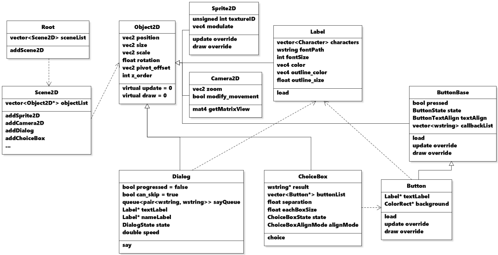

# snipe

> snipe is a visual novel engine based on OpenGL and C++.  
> you can check out the demo project on release page.  
> *please check that you've selected x86 as a target platform before you build on Visual Studio.*

---

# contents

- [features](#features)
- [thirdparty libraries](#thirdparty-libraries)
- [build environment](#build-environment)
- [simplified class diagram](#simplified-class-diagram)
- [getting started](#getting-started)
- [using snipe as a 2D OpenGL engine](#using-snipe-as-a-2D-OpenGL-engine)
- [information](#information)
- [todo](#todo)

---

# features

- printing dialogues

- showing standing image

- playing audio

- showing choice menu

- save & load system

- save & load persistent data

- built-in UI system

- custom interpreted script engine

- screen language interpreter

---

# thirdparty libraries

- [GLFW](https://www.glfw.org/) -  zlib license - for creating window and handle inputs

- [GLAD](https://glad.dav1d.de/) - MIT license - for loading OpenGL functions

- [glm](https://github.com/g-truc/glm) - MIT license - for using matrix operation

- [freetype](https://freetype.org/) - FreeType license - for loading font files and rasterizing it

- [stb](https://github.com/nothings/stb) - MIT license - for loading & writing image files

- [miniaudio](https://miniaud.io/) - MIT-0 license - for playing audio files

---

# build environment

- Compiler : Visual Studio 2022 ISO C++ 17 Standard (MSVC 2022 17.7)

- OS : Windows 11

---

# simplified class diagram



---

# getting started

> to get started, you should assert that you have following files in a same folder : `snipe.exe`,  `script.txt`, `screen.txt`. (`game` folder is optional, you can create any folder in root directory and access to it by writing `res:\ ` in file path : `res:\game\audio\song.mp3`)

```
.
├── snipe.exe     *
├── screen.txt    *
├── script.txt    *
└── game/
    ├── audio/
    |   └── song.mp3
    ├── image/
    ├── background/
    ├── ui/
    ├── font/
    └── script/
```

> step 1. write following text to `screen.txt` :
> 
> (if you get error messages while loading fonts, use your custom font file path instead of "C:\\Windows\\Fonts\\arial.ttf".)

```
new "root"
    def "window_title"                = "\"Untitled\""
    def "current_scene"               = "main"
    new "scene"
        def "name"                    = "main"
        def "current_camera"          = "cam"
        def "current_dialog"          = "dialog"
        def "current_choicebox"       = "choice"
        new "camera"
            def "name"                = "cam"
        new "dialog"
            def "name"                = "dialog"
            def "font_color"          = vec4(1, 1, 1, 1)
            def "font_path"           = "C:\Windows\Fonts\arial.ttf"
            def "font_size"           = 32
            def "position"            = vec2(360, 720)
            def "size"                = vec2(900, 200)
            def "namelabel_position"  = vec2(360, 650)
            def "namelabel_font_path" = "C:\Windows\Fonts\arial.ttf"
        new "choicebox"
            def "name"                = "choice"
            def "font_path"           = "C:\Windows\Fonts\arial.ttf"
            def "font_size"           = 32
            def "position"            = vec2(500, 300)
            def "size"                = vec2(600, 200)
            def "each_box_size"       = 50.0
```

> step 2. write following text to `script.txt` :

```python
# define characters.
# first parameter means charcter's name.
# second one means character's namebox color.
char a "a" vec4(0.96, 0.478, 0.54, 1)
char b "b" vec4(0.529, 0.8, 1, 1)

# define string variables called "player" and "hello".
# variable "player" has a value of "b".
# you can receive string input from player by using "input" keyword.
string player "b", hello "world"

# define label called "start".
# unlike Ren'Py, you should call / jump to "start" label on global scope by yourself.
label start
    # a will say "Nice to see you, b".
    # you can access to variable using ["variable name"] in a string.
    a "Nice to see you, [player]."

    # show the choice menu.
    choice
        # if you want some character to say something as the choice event starts,
        # write it once in the choice keyword's scope.
        b "What should I say?"

        # you can add choices by using "case" keyword.
        # when the choice event is finished, interpreter will execute the following lines of "case" keyword.
        case "Me too! It's been a while."
            jump "good_ending"
        case "Who are you?"
            jump "bad_ending"

label good_ending
    "good ending."

label bad_ending
    "bad ending."

# jump to label called "start".
jump_main "start"
```

> step 3. now run snipe.exe.  to get more information, please read `HOW_TO_USE.md`.

---

# using snipe as a 2D OpenGL engine

> you can use snipe as a 2D OpenGL engine - please modify `main.cpp` like following code.

```cpp
/* main.cpp */
#include "main.h"

Root* root;

int main() {
    // if you don't use multi-threading things, you should set this variable false
    SNIPE_USING_MULTITHREAD = false;
    // to set attributes about creating window, change the variables of root before initialize it.
    root->WINDOW_WIDTH = 1600;
    root->WINDOW_HEIGHT = 900;
    root->init();
    /*
    // your initializing code here...
    // you can make your own class that inherits Object2D and add to scene.
    // intializing code looks like this - 

    Scene2D* myScene = root->addScene2D(L"myScene");
    root->currentScene = myScene;
    Camera2D* myCamera = myScene->addCamera2D(L"myCamera");
    myScene->makeCameraCurrent(myCamera);

    // you should define add[class name] function
    // to Scene2D class before using this
    myScene->addMyClass(L"myClass"); 
    */
    while (not glfwWindowShouldClose(root->window)) {
        root->process_frame();
    }
    root->quit();
    return 0;
}
```

> to use Dialog and ChoiceBox class on C++, use it like following code :

```cpp
/* myClass.cpp */
static int choiceResult = -1;
static void test(Root* root) {
    Dialog* myDialog = root->currentScene->getObject(L"Dialog", L"myDialog");
    ChoiceBox* myChoiceBox = root->currentScene->getObject(L"ChoiceBox", L"myChoiceBox");

    // to say something :
    myDialog->say(L"myName", L"Hello World");

    // to show the choice menu :
    myChoiceBox->choice({L"1", L"2", L"3"}, &choiceResult);
}

void myClass::update() {
    FrameEvent event = owner->root->currentFrameEvent;
    if (choiceResult != -1){
        std::cout << "selected index: " << choiceResult << "\n";
        choiceResult = -1;
    }
    if (event.justKeys[GLFW_KEY_SPACE].action == GLFW_PRESS){
        test(owner->root);
    }
}
```

---

# information

- this project will run only on Windows.

- i did not apply many encapsulations because my ultimate goal was control engine through the custom script, not in C++. In addition, i hate to write many set / get functions.

- there are some unsolved problems(i'll try to fix it) :
  
  - slider class does not work well when zoom in / out or rotate the camera.
  - textedit class supports only 1 line that can be inputted.
  - camera2d class's offset works a little bit weird when window being set to full size.
  - you cannot input space(' ') when cursor position of textedit class is zero.

- the source of GLFW has been modified for Windows build.

- i did not write code in Modern-OpenGL style because i had a problem with shader overlapping. furthermore, you can save many of GPU memories by not creating VBO & VAOs and shader.

- like python, you have to use 4 spaces instead of 1 tab when creating new scope in script.

- if there's non-english characters in executable's path, it won't work.

- this engine uses multi-thread. so there's should be undiscovered problems about that.

- you cannot use numbers in variable / object's name.

---

# todo

- [ ] compress all the image files using stb_image and convert it to 1 file using zlib.
- [ ] create pixelate shader.
- [ ] implement array operator([ ])

---

2023-08-18 ~  
MIT Licensed.
